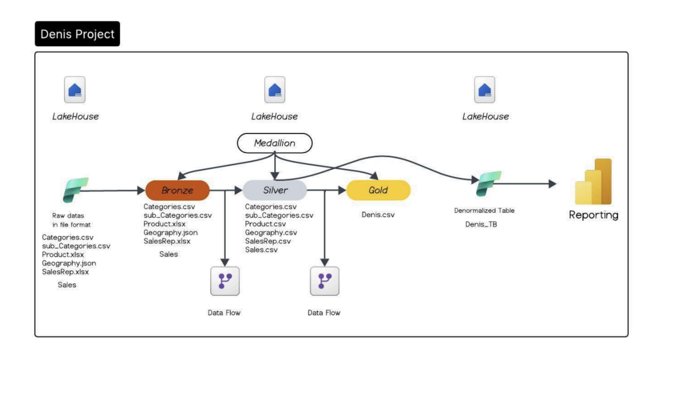

# Denis Project in Microsoft-Fabric

<h2> 📌 Project Overview </h2>

This project implements a centralized data warehousing solution using Microsoft Fabric Lakehouse architecture. It integrates sales-related data from multiple sources and transforms it into a curated model ready for reporting and analytics.

The solution follows the Medallion Architecture (Bronze → Silver → Gold) to ensure scalability, data quality, and business-ready insights.

<h2> 🎯 Project Objective </h2>

Build a centralized data warehouse in Microsoft Fabric to:

Integrate sales data from multiple sources (Flat files, Excel, CSV, JSON)

Clean, transform, and standardize raw data

Create a single business-ready dataset

Enable reporting and analytical insights

<h2> 🏗 Architecture Overview</h2>

<h2>🔹 Bronze Layer (Raw Data)</h2>

<h3> Purpose: </h3> Store raw ingested data without transformation.

<h3>Data Sources:</h3>

Sales.csv

Products.xlsx

Customers.json

Geography.json

Categories.csv

Subcategories.csv

<h3>Key Features:</h3>

Maintains original structure

Enables traceability and auditing

Supports reprocessing

<h2>🔹 Silver Layer (Cleaned & Standardized Data)</h2>

<h3>Purpose:</h3> Improve data quality and prepare it for modeling.

<h3>Transformations Applied:</h3>

Data type standardization

Handling null values & duplicates

Data cleansing & formatting

Schema alignment

<h3>Output Tables:</h3>

Cleaned Sales

Cleaned Products

Cleaned Customers

Geography

Categories & Subcategories

<h2>🔹 Gold Layer (Business-Ready Data)</h2>

<h3>Purpose:</h3> Deliver curated datasets optimized for analytics and reporting.

<h3>Features:</h3>

Denormalized tables

Business logic & calculations

Optimized for Power BI reporting

<h3>Output:</h3>

Fact and dimension tables

Business metrics for decision-making

<h2>🔄 Data Flow</h2>

Raw data ingested into Bronze layer

Data cleaned and standardized in Silver layer

Business logic applied to create Gold layer

Gold layer feeds reporting and analytics

<h2> 📊 Reporting & Analytics </h2>
The Gold layer supports reporting tools such as:
<ul>
<li>Power BI</li>

<li>Fabric Notebooks & SQL Endpoints</li>

<li>Dashboarding & KPI tracking</li>
  
</ul>

<h3>Key Insights Enabled:</h3>

Sales performance analysis
<ul>
  <li>Customer behavior insights</li>
  <li>Product & category trends</li>
  <li>Geographic sales distribution</li>
</ul>

<h2> 🛠 Technologies Used </h2>

Microsoft Fabric

Lakehouse Architecture

Data Pipelines / Dataflows Gen2

Spark / Notebooks

Power BI
